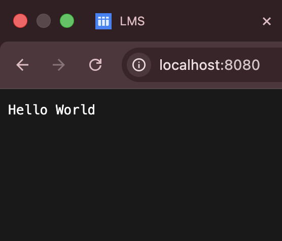
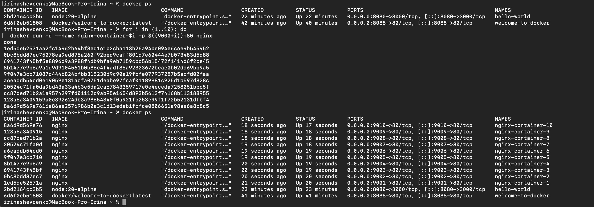
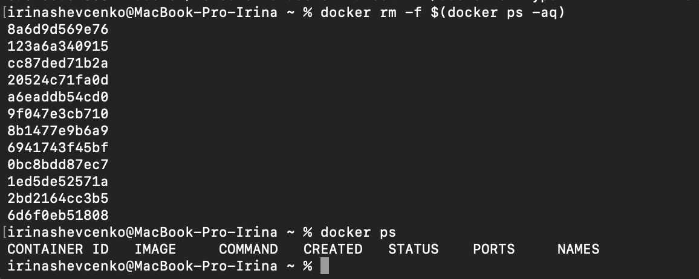

# Running Hello World container

`docker run -p 8080:3000 --name hello-world  node:20-alpine \
  sh -c "echo \"const http = require('http'); \
  http.createServer((req,res)=>{res.end('Hello World');}).listen(3000,'0.0.0.0');\" > app.js && node app.js" `

# Nginx 10 times running

`for i in {1..10}; do
  docker run -d --name nginx-container-$i -p $((9000+i)):80 nginx
done`

# Force stop and remove all containers

`docker rm -f $(docker ps -aq)`

