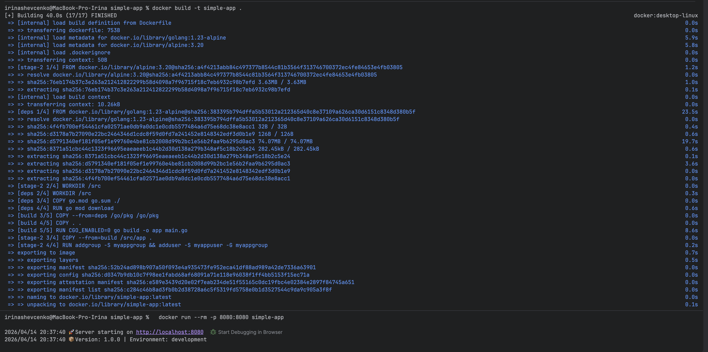
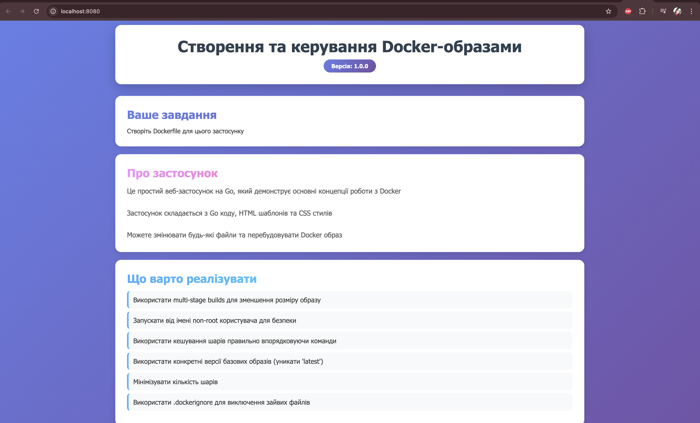
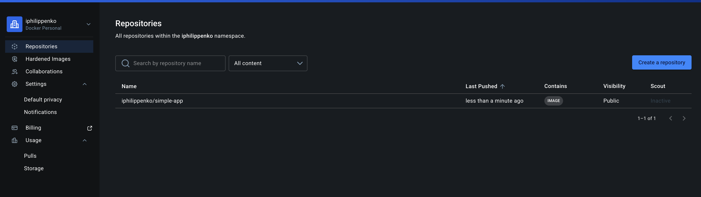
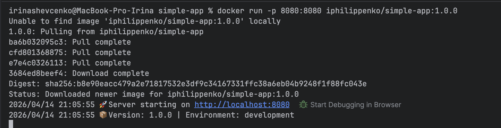

# Build + run container
 
`
docker build -t simple-app .
`

`
docker run --rm -p 8080:8080 simple-app
`

# Docker Hub publishing + usage

Build
`
docker build -t simple-app:1.0.0 .  
`

Tag
`
docker tag simple-app:1.0.0 iphilippenko/simple-app:1.0.0 
`

Push
`
docker push iphilippenko/simple-app:1.0.0
`

Pull+Run from Docker Hub registry
`
docker run -p 8080:8080 iphilippenko/simple-app:1.0.0
`

