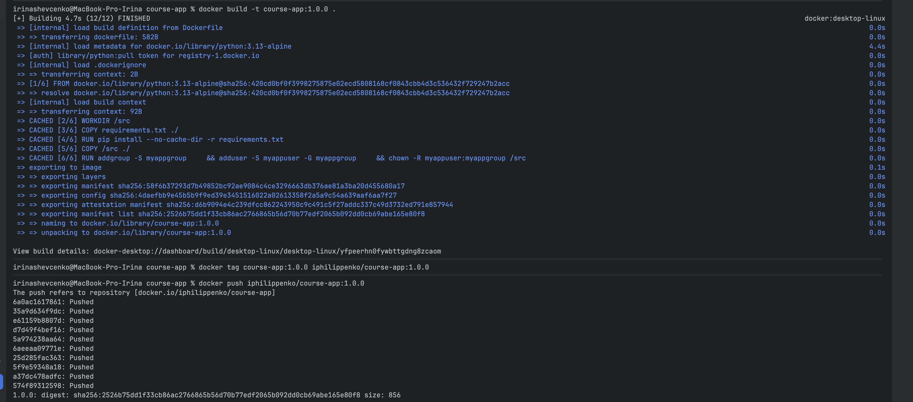
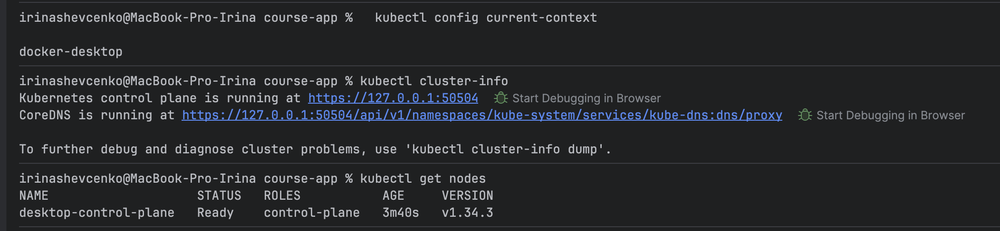
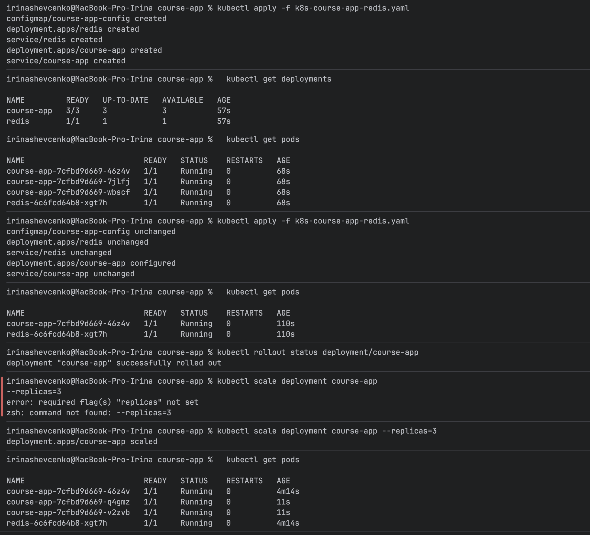
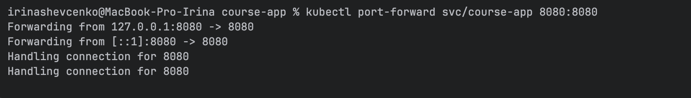
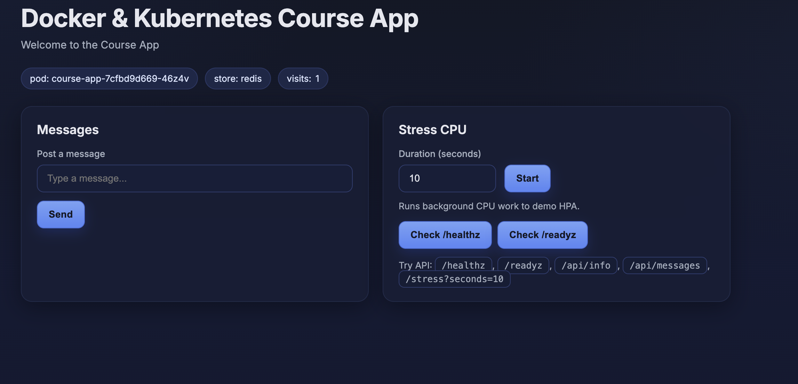

## Image publish

`docker build -t course-app:1.0.0 . `

`docker tag course-app:1.0.0 iphilippenko/course-app:1.0.0`

`docker push iphilippenko/course-app:1.0.0`

## Cluster creation, checking context (used Docker Desktop)

`kubectl config current-context`

`kubectl cluster-info`

`kubectl get nodes`

## Manifest apply, check deployments/pods, redeploy, scale

`kubectl apply -f k8s-course-app-redis.yaml`

`kubectl get deployments`

`kubectl get pods`

`kubectl apply -f k8s-course-app-redis.yaml`

`kubectl get pods`

`kubectl rollout status deployment/course-app`

`kubectl scale deployment course-app --replicas=3`

`kubectl get pods`

`kubectl port-forward svc/course-app 8080:8080` - port forward to be accessible on local

