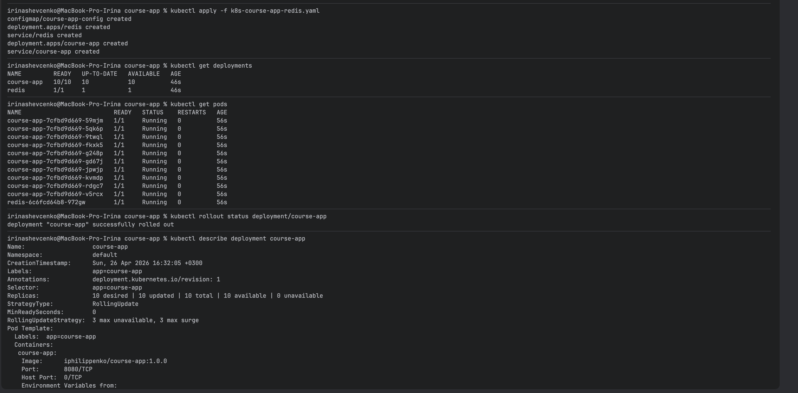
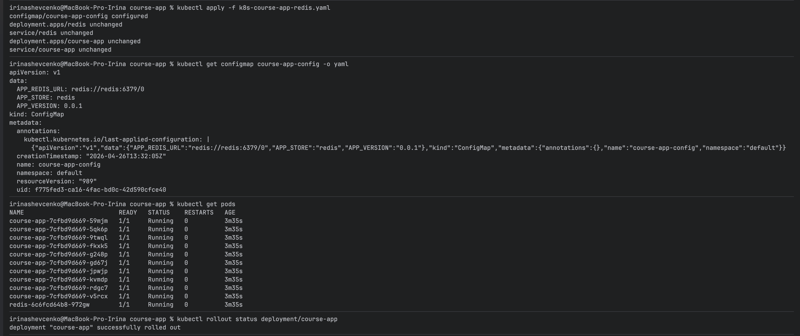
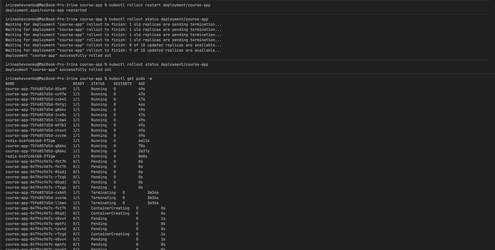
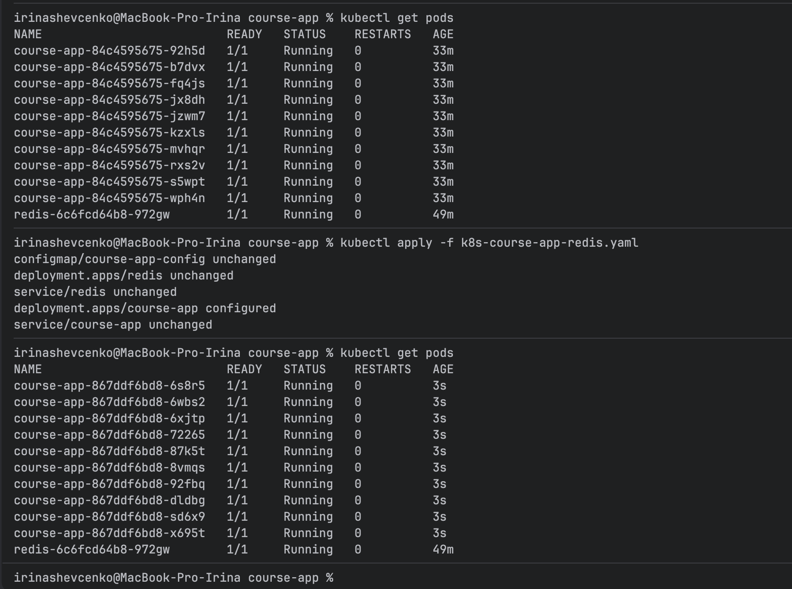
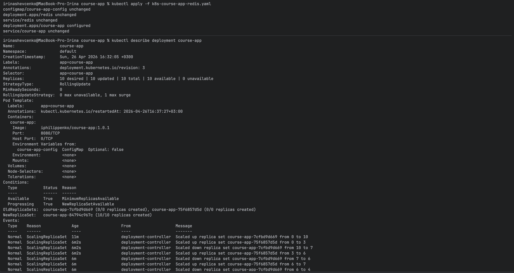
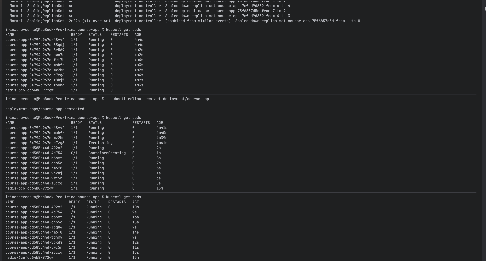
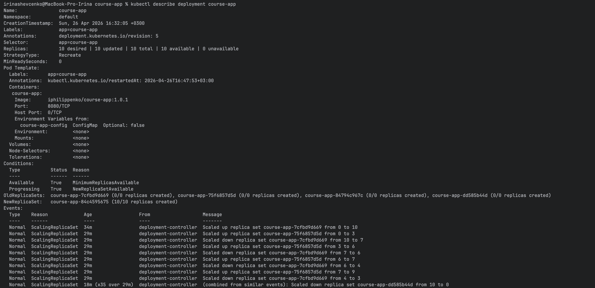
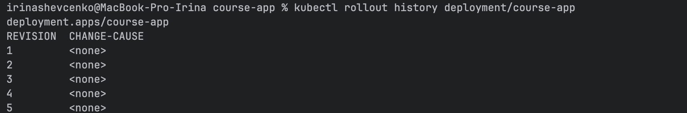
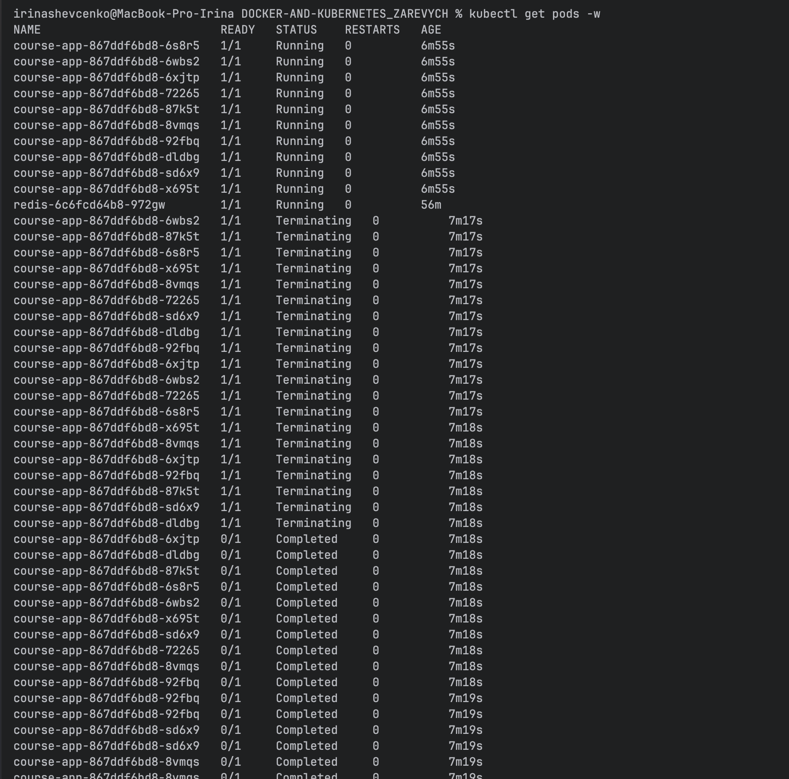
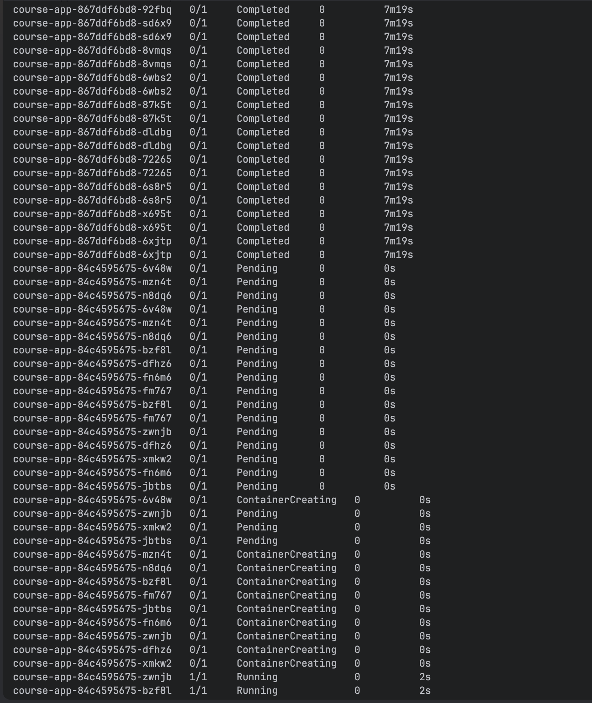

## Commands used

### Config apply
`kubectl apply -f k8s-course-app-redis.yaml`

### Get deployments/pods(watch mode)
`kubectl get deployments`

`kubectl get pods`

`kubectl get pods -w`

### Check deployment status
`kubectl rollout status deployment/course-app`

### Restart deployment
`kubectl rollout restart deployment/course-app`

### Describe deployment
`kubectl describe deployment course-app`

### Check configmap info
`kubectl get configmap course-app-config -o yaml`

### Check deployment history
`kubectl rollout history deployment/course-app`

## Initial run

## Apply configmap updates
Configmap configured but pods unchanged

Restart with configmap changes

## Pods restart in image change without restart on apply

## Rolling update configuration update

## Recreate config

## Rolling update vs Recreate
Recreate: проста поведінка, не тримає одночасно і стару і нову версію. Немає поступового оновлення под, а повністю заміняє старі - новими
RollingUpdate: акцент на безперервній доступності без downtime 

## Rollout history, pods history

